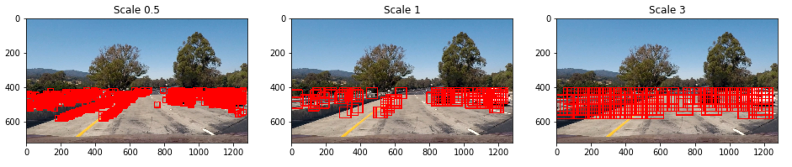

# Vehicle Detection Project

The goals / steps of this project are the following:

* Perform a Histogram of Oriented Gradients (HOG) feature extraction on a labeled training set of images and train a classifier Linear SVM classifier
* Optionally, you can also apply a color transform and append binned color features, as well as histograms of color, to your HOG feature vector. 
* Note: for those first two steps don't forget to normalize your features and randomize a selection for training and testing.
* Implement a sliding-window technique and use your trained classifier to search for vehicles in images.
* Run your pipeline on a video stream (start with the test_video.mp4 and later implement on full project_video.mp4) and create a heat map of recurring detections frame by frame to reject outliers and follow detected vehicles.
* Estimate a bounding box for vehicles detected.

## [Rubric](https://review.udacity.com/#!/rubrics/513/view) Points

---
### Writeup / README

#### 1. Provide a Writeup / README that includes all the rubric points and how you addressed each one.  You can submit your writeup as markdown or pdf. 

You're reading it!

### Histogram of Oriented Gradients (HOG)

#### 1. Explain how (and identify where in your code) you extracted HOG features from the training images.

You can find the code for extracting HOG features in the jupyter notebook called Final.ipynb. I started with using glob to read the filepaths of all vehicle and non-vehicle images (cell 2, line 1 - 2).

In cell 3 line 1 - 15 you see the actual HOG feature extraction being done by the hog function of the skimage library. It takes in:

* an image
* a number of orientations
* the number of pixels per cell
* the number of cells per block
* a vis boolean to enable visualization
* a feature_vec boolean that decides whether or not to output a feature vector
 

 
Before images are fed to the get_hog_features() function, they are passed through the image_to_features() function on line 33 - 62. Here the brightness of an image is:

1. first randomly adjusted (to make the training less bias to brightness) (line 36 - 38). 
2. It's then converted to a desired color space (line 39).
3. The next stage is applying spatial binning (line 41 - 43)
4. A histogram of colors is extracted (line 45 - 47)
5. And finally the HOG features are extracted (line 49 - 60)

#### 2. Explain how you settled on your final choice of HOG parameters.

A lot of trial and error. One of the things that really helped to visualize everything was interact (Project.ipynb, cell 13). After that it was testing on three test images (Final.ipynb cell 11, line 1 - 6) and on (a subclipped part of) the movie (cell 12). I finally decided on the following parameters:

* Spatial bin size: (32, 32)
* No. histogram bins: 32
* Window size: 128 x 128
* Color space (for spatial binning, histogram and hog): YCrCb
* No. vector orientations HOG: 10
* No. pixels per cell: 8
* No. cells per block: 2

Reflected in cell 4 line 100 - 107

#### 3. Describe how (and identify where in your code) you trained a classifier using your selected HOG features (and color features if you used them).

I trained a LinearSVC with features extracted by using the steps described under point 1:

1. first randomly adjusted (to make the training less bias to brightness) (line 36 - 38). 
2. It's then converted to a desired color space (line 39).
3. The next stage is applying spatial binning (line 41 - 43)
4. A histogram of colors is extracted (line 45 - 47)
5. And finally the HOG features are extracted (line 49 - 60)

First the features are extracted for cars (cell 5, line 2) and non-card (cell 5, line 3), the features are stacked (line 6), labels are created (1 for car, 0 for non car, line 10). The data is normalize (line 7 - 8) and the data is randomly shuffled (line 12 - 13). After these steps the LinearSVC classifier is initiated (line 15) and the classifier is trained (line 16)

### Sliding Window Search

#### 1. Describe how (and identify where in your code) you implemented a sliding window search.  How did you decide what scales to search and how much to overlap windows?

To keep the pipeline reasonably fast I decided to go for the HOG subsampeling window search. This is done in the find_cars() function (cell 4, line 97 - 175). First the image is cropped vertically to exclude the sky and the bonnet of the car (line 110), then the image is converted to the YCrCb color space (line 111). The image is resized (to effectively change the window size, line 113 - 115). The HOG features are extracted over all three channels (line 133 - 135). Finally the HOG subsample is extracted (line 137 - 149), the spatial bin (line 155), the color histogram (line 156) are extracted and the predictions are made (line 162 - 164). I have opted not to go for a straight yes or no predict, but to apply my own weight on it (line 164). The very last step is drawing the windows (line 165 - 173).

#### 2. Show some examples of test images to demonstrate how your pipeline is working.  What did you do to optimize the performance of your classifier?

I decided finally on using a range of subsamples (cell 10, line 20). It starts at size 1 and scaled up to 4 in steps of .3. I used a YCrCb color space and spatial binning as well as a color histogram. This resulted in the following test results:

---

### Video Implementation

####1. Provide a link to your final video output.  Your pipeline should perform reasonably well on the entire project video (somewhat wobbly or unstable bounding boxes are ok as long as you are identifying the vehicles most of the time with minimal false positives.)
Here's a [link to my video result](./out_project_video.mp4)

####2. Describe how (and identify where in your code) you implemented some kind of filter for false positives and some method for combining overlapping bounding boxes.

I recorded the positions of the found windows and applied a heat map over them (cell 9, line 41 - 64). From the heatmap I applied a threshold and drew a shape image (cell 10, line 31 - 33). From there I drew the final boxes. To create a more stable result I saved the windows of the last 20 frames (cell 10, line 23 - 26) and set a high threshold over all results (line 28). This has helped with reducing the false positives.

### Here are some results of the heatmaps, the shapes and the final boxes

---

###Discussion

####1. Briefly discuss any problems / issues you faced in your implementation of this project.  Where will your pipeline likely fail?  What could you do to make it more robust?

This project shows how relatively simple classifiers (compared with neural networks) can be used to quickly identify cars with a reasonable performance. Further training and fine tuning could definitely improve the performance, but tuning the load of parameters proves to be really cumbersom. Using neural networks I am confident a more robust result could be achieved. My current pipeline seems to be the most likely to fail in chaning lighting conditions. 

